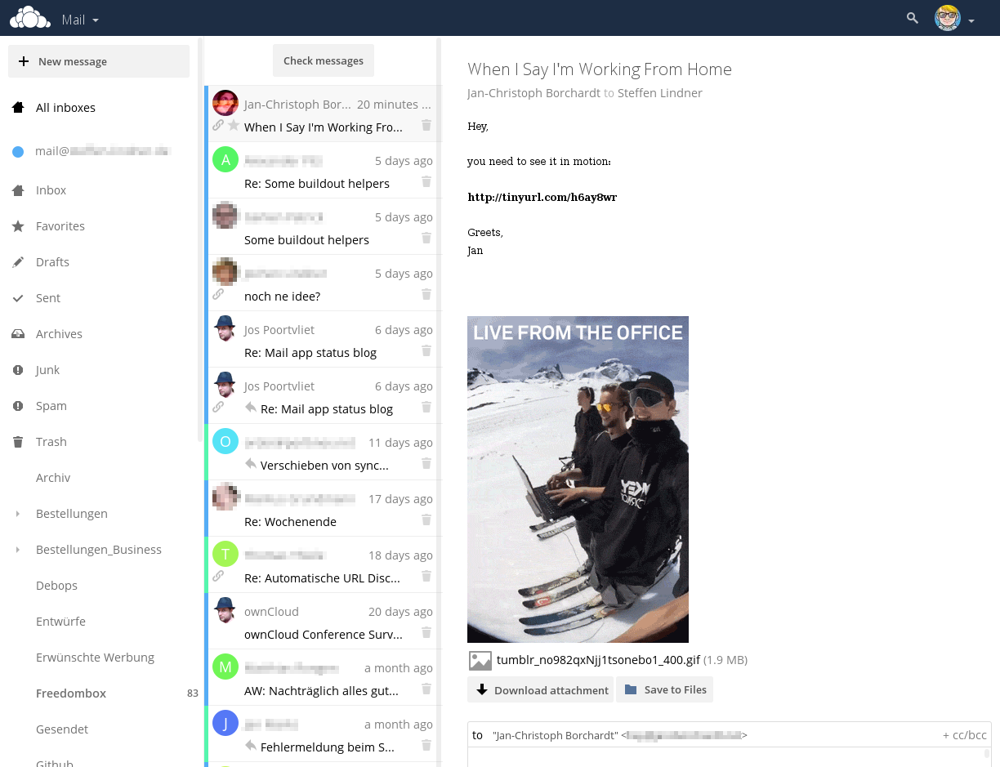

# ownCloud Mail


[](https://travis-ci.org/DeepDiver1975/mail)
[](https://scrutinizer-ci.com/g/DeepDiver1975/mail/?branch=master)
[](https://scrutinizer-ci.com/g/DeepDiver1975/mail/?branch=master)
[](https://coveralls.io/github/DeepDiver1975/mail)

**An email app for [ownCloud](https://owncloud.org)**




## Why is this so awesome?

* :rocket: **Integration with other ownCloud apps!** Currently Contacts, Calendar & Files – more to come.
* :inbox_tray: **Multiple mail accounts!** Personal and company account? No problem, and a nice unified inbox.
* :lock: **Send & receive encrypted emails!** Using the great [Mailvelope](https://mailvelope.com) browser extension.
* :see_no_evil: **We’re not reinventing the wheel!** Based on the great [Horde](http://horde.org) libraries.

## Usage

### Keyboard shortcuts for Mail

Speed up your Mail experience by using keyboard shortcuts.

#### Compose

| Action | Shortcut                           |
| ------ | ---------------------------------- |
| Send   | <kbd>Ctrl</kbd> + <kbd>Enter</kbd> |

#### Actions

| Action        | Shortcut       |
| ------------- | -------------- |
| Refresh       | <kbd>R</kbd>   |
| Toggle star   | <kbd>S</kbd>   |
| Delete        | <kbd>Del</kbd> |
| Toggle unread | <kbd>U</kbd>   |

##### Navigation

| Action        | Shortcut                     |
| ------------- | ---------------------------- |
| Newer message | <kbd>K</kbd> or <kbd>←</kbd> |
| Older message | <kbd>J</kbd> or <kbd>→</kbd> |

## Troubleshooting

### Gmail

If you can not access your Gmail account use https://accounts.google.com/DisplayUnlockCaptcha to unlock your account.

### Outlook.com

If you can not access your Outlook.com account try to enable the 'Two-Factor Verification' (https://account.live.com/proofs/Manage) and setup an app password (https://account.live.com/proofs/AppPassword), which you then use for the ownCloud Mail app.

### Dovecot IMAP

If your Dovecot IMAP server prefixes all folders with `INBOX`, ownCloud Mail does not work correctly.

Check `/etc/dovecot/dovecot.conf`:

```
namespace inbox {
        separator = .
        # All folders prefixed
        # prefix = INBOX.
        prefix =
        inbox = yes
        type = private
}
```


## Developer setup info

Just clone this repo into your apps directory (ownCloud server installation needed). Additionally,  [nodejs and npm](https://nodejs.org/en/download/package-manager/) are needed for installing JavaScript dependencies.

Once node and npm are installed, PHP and JavaScript dependencies can be installed by running
```bash
make install-composer-deps
make optimize-js
```

### Resetting the app
Connect to your database and run the following commands (`oc_` is the default table prefix):
```sql
DELETE FROM oc_appconfig WHERE appid = 'mail';
DROP TABLE oc_mail_accounts;
DROP TABLE oc_mail_aliases;
DROP TABLE oc_mail_collected_addresses;
```


## Configuration

Certain advanced or experimental features need to be specifically enabled in your `config.php`:

### Debug mode
You can enable IMAP and SMTP backend logging. A horde_imap.log for IMAP and horde_smtp.log for SMTP will appear in the same directory as your owncloud.log.
#### IMAP logging:
```php
'app.mail.imaplog.enabled' => true
```
#### SMTP logging:
```php
'app.mail.smtplog.enabled' => true
```

### Timeouts:
Depending on your mail host, it may be necessary to increase your IMAP and/or SMTP timeout settings. Currently IMAP defaults to 20 seconds and SMTP defaults to 2 seconds. They can be changed with.

#### IMAP timeout:
```php
'app.mail.imap.timeout' => 20
```
#### SMTP timeout:
```php
'app.mail.smtp.timeout' => 2
```
### Use php-mail for mail sending
You can use the php mail function to send mails. This is needed for some webhosters (1&1 (1und1)):
```php
'app.mail.transport' => 'php-mail'
```
